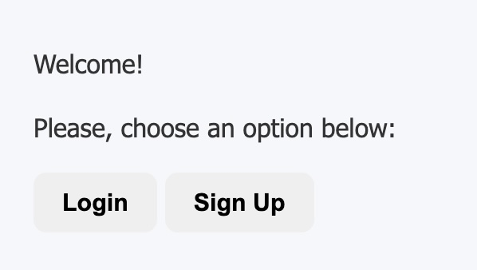
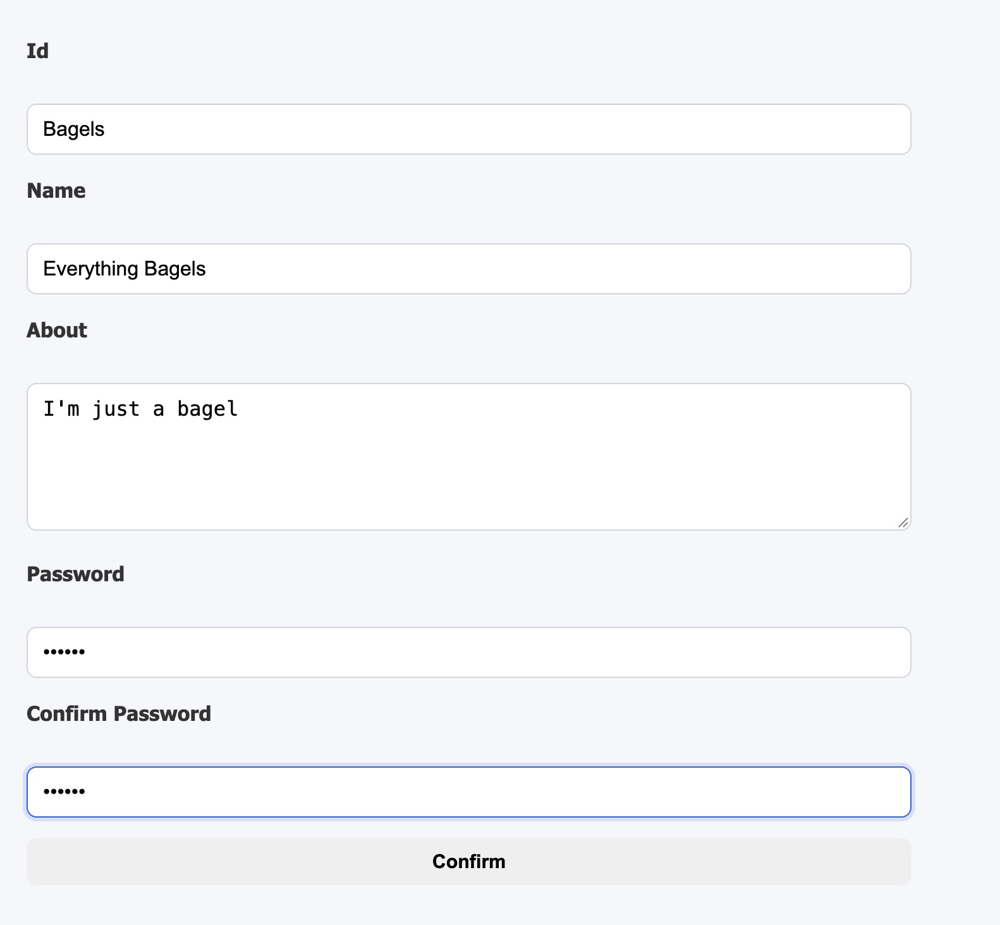
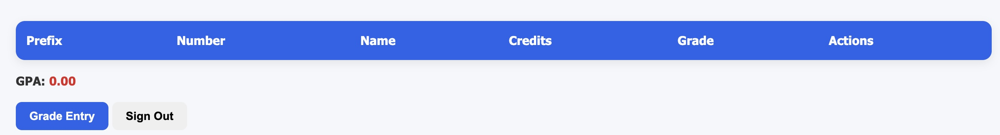
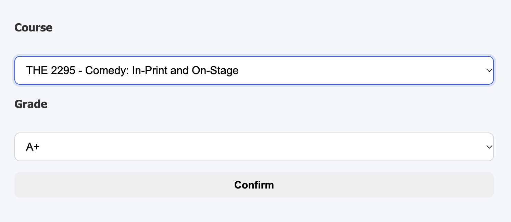
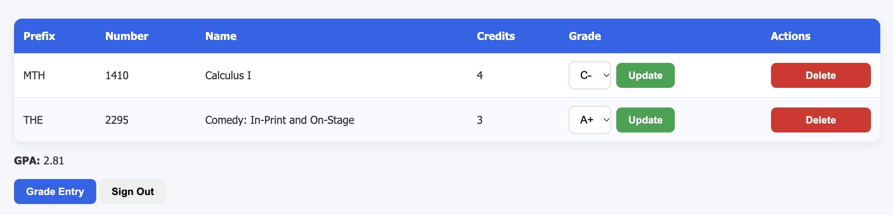

# SWD_Proj1 Overview
Author Names: Steph Rivera, Tyler Black, Cameron Greeson, Pete Dives
Repo URL: https://github.com/FrostyBagels/SWD_Proj1

In this project, our group developed a simple web application that allows students to track their GPAs. Students are able to register for the application and, after successfully logging in, enter completed courses along with their corresponding letter grades. The application then displays all previously entered courses and calculate their overall GPA. Students are also able to update their letter grades if they were entered incorrectly.

# Process Requirement
The team was required to use the Waterfall process model to follow its traditional phases: 
    - Communication
    - Planning
    - Modeling
    - Construction
    - Deployment

# Communication Phase
## Team Roles

|Name|Role(s)|
|--|--|
| Cameron | Developer |
| Tyler | Tester & Documentation |
| Stephanie | Manager & Documentation | 
| Pete | Developer 2 & Documenter |

# Planning Phase
## Schedule

|Phase|Task|Start|End|Duration|Deliverable|
|---|---|---|---|---|---|
|Modeling|Requirements Analysis|09/21/26|09/24/26|3 days|Use Case Diagram|
|Modeling|Data Model|09/21/26|09/24/26|3 days|Class Diagram|
|Construction|Coding|09/25/26|09/30/26|5 days|Code|
|Construction|Testing|09/25/26|10/02/26|7 days|Test Report|
|Deployment|Delivery|10/02/26|10/03/26|1 days|Final Commit/Push|

# Construction Phase
In order to build the package to run our app, you will need: 
    - Python 3.10 or newer
    - pip

### 1. Cloning repository & setting up virtual environment

git clone https://github.com/FrostyBagels/SWD_Proj1.git
cd SWD_Proj1
python3 -m venv .venv

For macOS/Linux: 
source .venv/bin/activate

For Windows Command Prompt: 
.venv\Scripts\activate

For Windows PowerShell: 
.venv\Scripts\Activate.ps1

### 2. Installing project dependencies and packages

python -m pip install --upgrade pip
python -m pip install -r requirements.txt

### 3. Running Flask 
For macOS/Linux: 
PYTHONPATH=src python -m flask --app app run --port 5001

For Windows Command Prompt: 
set PYTHONPATH=src
python -m flask --app app run --port 5001

For Windows PowerShell: 
$env:PYTHONPATH="src"
python -m flask --app app run --port 5001

Copy & paste the following address in a web browser if desired: 
http://127.0.0.1:5001 

# Deployment Phase
## User Interface
Students will have two options when they land on the home page: 

To log in, they will select Login.

To register, they will select Sign Up.

First time users will see the Enrollments screen empty.

To add courses and grades, click on Grade Entry. Select course and grade from the drop-down menus. 

Once necessary courses have been added, the Enrollments screen will automatically calculate the GPA.

Students can update grades at any time by selecting a new letter grade and clicking Update. Students can delete courses at any time by clicking on Delete. The GPA automatically updates whenever a course is added, a grade is updated, or a course is deleted.